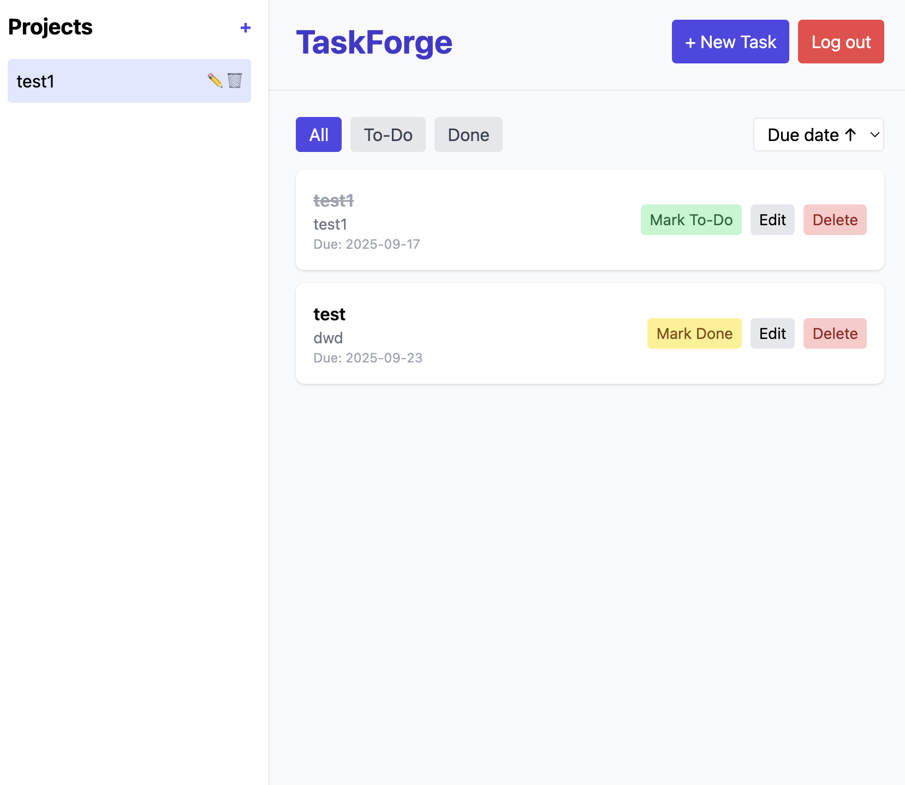

# TaskForge

TaskForge is a **full-stack task management web application** built with **React**, **TypeScript**, **Firebase Authentication** and **Cloud Firestore**.  
It enables users to register and log in securely, create and manage multiple projects, add, edit and delete tasks with due dates and statuses, and see real-time updates across devices. The interface is styled with **TailwindCSS** and deployed on **Firebase Hosting**.



## Features

- 🔐 **Secure Authentication** – Firebase Auth for user registration and login  
- 📂 **Projects** – Create, edit and delete projects, each with its own task list  
- ✅ **Tasks** – Add, edit, delete tasks; mark as to-do or done; due date support  
- ⚡ **Real-time Updates** – Cloud Firestore keeps data in sync across devices  
- 🎨 **Responsive UI** – TailwindCSS for clean, modern styling  
- ☁️ **Deployment** – Firebase Hosting for fast, free hosting

## Tech Stack

- **Frontend**: React + Vite + TypeScript
- **Authentication**: Firebase Authentication
- **Database**: Cloud Firestore (per-user projects & tasks)
- **Styling**: TailwindCSS
- **Hosting**: Firebase Hosting

## Getting Started Locally

Clone the repository and install dependencies:

```bash
git clone https://github.com/PHM4/taskforge.git
cd taskforge
npm install
